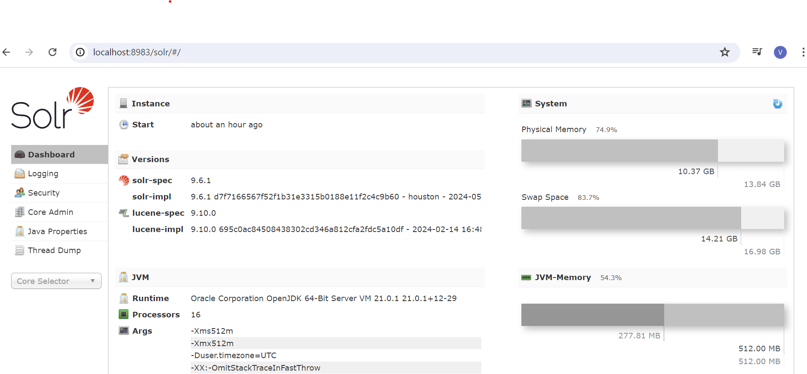
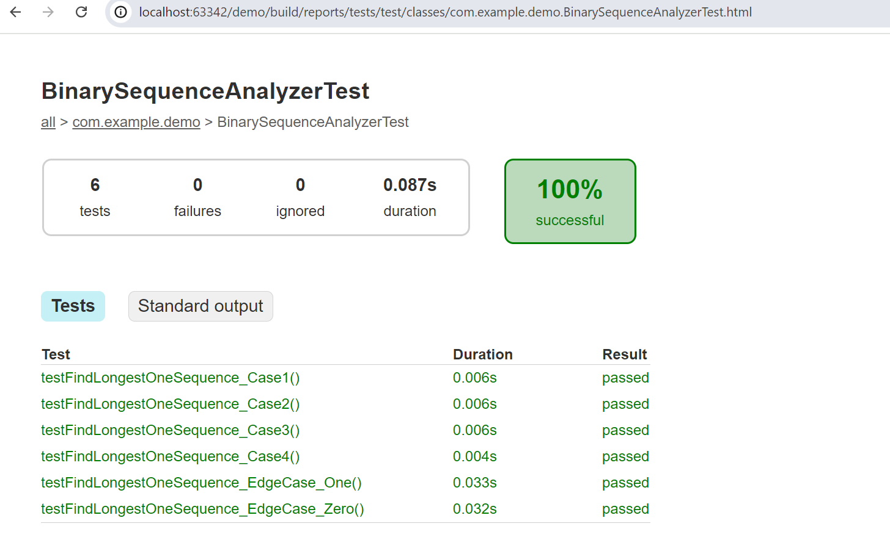

# Problem 1 : Word finder

There are two approaches for finding the word with the most occurrences of a given character in a statement:
1. In-memory approach using Java 21.(Code in [FindWordWithCharacterInMemory.java](src/main/java/com/example/demo/FindWordWithCharacterInMemory.java)
   and test cases in [FindWordWithCharacterInMemoryTest.java](src/test/java/com/example/demo/FindWordWithCharacterInMemoryTest.java))
2. Using Apache Solr for more efficient search capabilities. Lucene (now Solr) offers a scalable way for such uses and should be used when we expect use cases and data to grow. I have used Lucene before and done performance benchmarking. Conclusion was that its highly scalable and works very well for large data sets. Solr uses inverted indexing, which stores a mapping from content to its locations in a database file. This allows Solr to quickly locate and retrieve documents containing specific terms, making search operations much faster than traditional methods that scan each document sequentially.
   (Code in [FindWordWithCharacterInSolr.java](src/main/java/com/example/demo/FindWordWithCharacterInSolr.java)
   and test cases in [FindWordWithCharacterInSolrTest.java](src/test/java/com/example/demo/FindWordWithCharacterInSolrTest.java))
### Assumptions

- The input statement is a single string.
- Words are separated by spaces, punctuation marks, and other common delimiters.
- If multiple words have the same highest count of the given character, the longest word is selected.
- If there is still a tie, the first occurring word is selected.

### Pre-requisites

1. I used Java 21.
2. Solr can be installed from official site to run locally.

## Explanation and Test Cases
The test cases are implemented in the class `FindWordWithCharacterInMemoryTest.java`

| Test Case                              | Statement                                                                                     | Input Character | Expected Result | Explanation                                                                                       |
|----------------------------------------|-----------------------------------------------------------------------------------------------|-----------------|-----------------|---------------------------------------------------------------------------------------------------|
| Case 1                                 | "This is a very long sentence and I want to educate everyone in this whole crazy world…"      | 'z'             | crazy           | The character 'z' is only present in the word "crazy".                                            |
| Case 2                                 | "This is a very long sentence and I want to educate everyone in this whole crazy world…"      | 'I'             | I               | The character 'I' is only present once, and it's case-sensitive.                                   |
| Case 3                                 | "This is a very long sentence and I want to educate everyone in this whole crazy world…"      | 'e'             | sentence        | Both "sentence" and "everyone" have 3 occurrences of 'e', but "sentence" occurs first.            |
| No Occurrences                         | "This is a very long sentence and I want to educate everyone in this whole crazy world…"      | 'x'             | ""              | The character 'x' is not present in any word.                                                     |
| Multiple Words Same Count and Length   | "This test case checks multiple words with same number of given character and same length tied together" | 't'             | test            | Both "test" and "together" have the same number of occurrences and length, but "test" appears first.  |

Test cases have passed in code committed: 

## Solr related notes

- https://solr.apache.org/downloads.html is offical site to download
- Commands to start and create your_core <pre>solr start</pre> <pre>solr create -c your_core</pre>
- Might need to unload and create core again when testing with changing input/documents
- http://localhost:8983/solr/#/ is the link to admin screen when installed. Look like this on my machine: 
- Solr commands on my machine 

# Problem 2 : Binary Sequence Analysis
 Relatively straight forward problem and can be achieved in one scan (for loop) and O(n) complexity where n=number of bits. Can maintain variables like currentSeqLength,maxSeqLength and come up with longest sequence with one loop alone.
Code in [BinarySequenceAnalyzer.java](src/main/java/com/example/demo/BinarySequenceAnalyzer.java) and test cases
 [BinarySequenceAnalyzerTest.java](src/test/java/com/example/demo/BinarySequenceAnalyzerTest.java)

## Explanation and Test Cases
The test cases are implemented in the class `BinarySequenceAnalyzerTest.java`

| Test Case                              | Input | Expected Result | Explanation                                                                                       |
|----------------------------------------|-------|-----------------|---------------------------------------------------------------------------------------------------|
| Case 1                                 | 156   | 4               | The binary representation of 156 is 10011100. The longest continuous 1s start at position 4.      |
| Case 2                                 | 88    | 3               | The binary representation of 88 is 1011000. The longest continuous 1s start at position 3.        |
| Edge Case (Zero)                       | 0     | 0               | The binary representation of 0 is 0. There are no 1s.                                             |
| Edge Case (One)                        | 1     | 1               | The binary representation of 1 is 1. The longest continuous 1s start at position 1.               |
| Case 3                                 | 255   | 1               | The binary representation of 255 is 11111111. The longest continuous 1s start at position 1.      |
| Case 4                                 | 2730  | 1               | The binary representation of 2730 is 101010101010. The longest continuous 1s start at position 1. |

Test cases have passed in code committed: 

## Assumptions Made in the Code

- Non-negative Input
- 1-Indexed Position
- No Leading Zeros
- If there are multiple sequences of `1`s of the same maximum length, the function returns the starting position of the first such sequence encountered.
- If the input number is `0`, the function returns `0` as there are no `1`s

